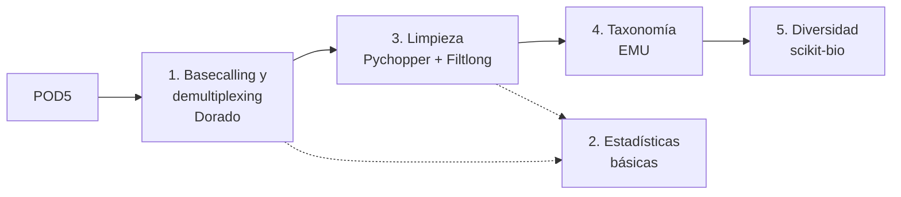

<div align="center">

# 16S-FenrirPipeline

**Rizobioma de la gulupa con secuenciación 16S en Oxford Nanopore y predicción de interacciones bacteria-fago**


</div>

## Introducción

Este repositorio reúne las herramientas bioinformáticas desarrolladas e implementadas para el trabajo de grado *Análisis del microbioma de Passiflora edulis f. edulis mediante secuenciación dirigida al gen 16S usando MinION, y predicción de las posibles interacciones bacteria-fago* (Johann Sebastian Gallego Sierra, Universidad El Bosque). Son dos:

- **Un pipeline propio** para procesar lecturas del gen 16S rRNA completo obtenidas con MinION, desde la señal cruda hasta la diversidad microbiana.
- **La implementación de DeepPBI-KG** ([Wei et al., 2024](https://github.com/Tongqing-Wei/DeepPBI-KG)), un modelo de aprendizaje profundo que predice interacciones entre fagos y bacterias, adaptado para recibir los perfiles taxonómicos que entrega el pipeline.

Ambas herramientas responden a una misma necesidad: conocer el rizobioma de la gulupa, es decir, qué bacterias lo componen y cómo cambia entre sistemas de manejo agrícola, y anticipar qué fagos podrían interactuar con esas bacterias. Ese conocimiento sirve de cimiento para formular, en el futuro, bioproductos dirigidos a este cultivo.

## Ramas del repositorio

| Rama | Contenido |
|---|---|
| [`pipeline`](https://github.com/xXFenrir/16S-FenrirPipeline/tree/pipeline) (esta rama) | Pipeline 16S ONT: basecalling, estadísticas, limpieza, taxonomía y diversidad (Objetivos 1 y 3) |
| [`algoritmo`](https://github.com/xXFenrir/16S-FenrirPipeline/tree/algoritmo) | Predicción de interacciones bacteria-fago con DeepPBI-KG (Objetivos 2 y 3) |
| [`anexos`](https://github.com/xXFenrir/16S-FenrirPipeline/tree/anexos) | Anexos del documento: tablas de resultados, figuras, matrices de predicción y grafos |

Las tablas de abundancia que produce este pipeline son la entrada de la rama `algoritmo`. Los datos crudos de gulupa no se publican por confidencialidad; pueden solicitarse al autor bajo acuerdo académico.

# Pasos del pipeline

Los pasos se describen tal como se aplicaron a las muestras de gulupa con el modelo de basecalling **HAC**. Todo se ejecutó en Linux con entornos conda, y los scripts están en [`pipeline_16S/`](pipeline_16S/), organizados por etapa.



| Paso | Script principal | Carpeta |
|---|---|---|
| [1. Basecalling y demultiplexing](#1-basecalling-y-demultiplexing) | Dorado (CLI) + `comparar_dorado.py` | `01_basecalling/` |
| [2. Reporte de estadísticas básicas](#2-reporte-de-estadísticas-básicas) | `stats_fastq.py` | `02_estadisticas/` |
| [3. Limpieza: denoising y trimming](#3-limpieza-denoising-y-trimming) | `dentrim_bam.py` | `03_limpieza/` |
| [4. Taxonomía](#4-taxonomía) | `EMU_propio.py` y scripts de conteos | `04_taxonomia/` |
| [5. Diversidad](#5-diversidad) | `diversidad_mod.py` | `05_diversidad/` |

---

## 1. Basecalling y demultiplexing

### Para qué sirve

El MinION no entrega secuencias: registra cambios de corriente eléctrica a medida que cada molécula de ADN atraviesa un poro. El basecalling traduce esa señal (archivos `POD5`) en lecturas de ADN, y el demultiplexing separa las lecturas según el barcode de cada muestra, porque todas se secuenciaron juntas en una misma celda. El resultado es un archivo BAM de lecturas por muestra, que es la entrada de los pasos siguientes.

### Herramientas

**Dorado** es el basecaller oficial de Oxford Nanopore, sucesor de Guppy. Usa redes neuronales entrenadas para convertir la señal de corriente en bases y ofrece tres modelos que intercambian velocidad por exactitud: `fast`, `hac` (*high accuracy*) y `sup` (*super accuracy*). Para el demultiplexing, busca en los extremos de cada lectura las secuencias de barcode del kit indicado y anota a qué muestra pertenece.

<details>
<summary>Instalación de Dorado y conversión desde FAST5</summary>

```bash
curl "https://cdn.oxfordnanoportal.com/software/analysis/dorado-2.1.0-linux-x64.tar.gz" -o dorado-2.1.0-linux-x64.tar.gz
tar -xzf dorado-2.1.0-linux-x64.tar.gz
dorado-2.1.0-linux-x64/bin/dorado --version

# Solo si la corrida quedó en FAST5 (Dorado solo lee POD5)
pod5 convert fast5 /ruta/fast5/*.fast5 --output pod5_out/
```
</details>

### Cómo se construyó el script

El basecalling se ejecuta directamente con Dorado. Siguiendo la recomendación del fabricante, basecalling y demultiplexing van en un solo comando, en lugar de demultiplexar después con otra herramienta como Porechop.

Para escoger el modelo, la corrida se procesó con FAST, HAC y SUP y se compararon con `comparar_dorado.py`. El script lee los `sequencing_summary.txt` de cada modelo por bloques (para no cargar millones de filas en memoria), separa los barcodes de la gulupa (01 a 73) de los de otro proyecto que compartió la corrida, y calcula por modelo y por barcode lecturas totales, lecturas *pass* y *fail*, bases, longitud media y mediana, N50 y QScore. Entrega un Excel con las tablas y gráficas comparativas.

### Ejecución

```bash
~/dorado-2.1.0-linux-x64/bin/dorado basecaller hac \
  /home/fenrir/Documentos/Tesis/datos_gulupa/20260715_1807_MN30942_FAZ24575_f8347d8d/pod5 \
  --kit-name SQK-NBD114-96 \
  --min-qscore 8 \
  --emit-summary \
  --output-dir /home/fenrir/Documentos/Tesis/datos_gulupa/data_gulupa_qs8/hac_8
```

- `hac` modelo de basecalling de alta precisión.
- La ruta posicional es la carpeta `pod5/` de la corrida.
- `--kit-name` kit de barcodes nativos usado en la librería; con él Dorado demultiplexa durante el basecalling.
- `--min-qscore` descarta lecturas con QScore medio menor que 8.
- `--emit-summary` escribe `sequencing_summary.txt`, con métricas por lectura.
- `--output-dir` carpeta de salida, con un BAM por barcode (`barcode01/`, `barcode02/`, ...).

```bash
python3 pipeline_16S/01_basecalling/comparar_dorado.py \
  --fast fast/sequencing_summary.txt \
  --hac hac_8/sequencing_summary.txt \
  --sup sup_8/sequencing_summary.txt \
  --mapa "Mapa Barcodes Microbioma.csv" \
  --out comparacion_dorado
```

- `--fast`, `--hac`, `--sup` `sequencing_summary.txt` de cada modelo; `--fast` es opcional y `--sin-fast` lo excluye de las tablas y gráficas.
- `--mapa` CSV que relaciona cada barcode con su muestra.
- `--out` carpeta donde se guardan el Excel y las gráficas.

---

## 2. Reporte de estadísticas básicas

### Para qué sirve

Antes de limpiar hay que saber en qué estado llegan las lecturas: cuántas son, qué longitud y calidad tienen, y si conservan los primers. Estas métricas permiten decidir si una muestra necesita limpieza, justificar los parámetros de filtrado y, al repetir el cálculo después de limpiar, medir cuánto se removió. El resultado es una tabla con una fila por muestra.

### Herramientas

Las métricas se calculan con código propio, sin herramientas bioinformáticas externas. Como complemento visual se generaron reportes con **pycoQC**, que resume la corrida a partir de `sequencing_summary.txt` (rendimiento en el tiempo, calidad y longitud por barcode), y con **NanoPlot**, que grafica la distribución de longitud y calidad de los FASTQ limpios. Sus reportes están en la rama `anexos` (Anexos 9 y 11).

### Cómo se construyó el script

`stats_fastq.py` recorre cada FASTQ (comprimido o no) una sola vez y acumula las métricas: lecturas, bases totales, longitud media, mínima y máxima, N50, %GC, QScore promedio y QScore medio mínimo y máximo por lectura. Si recibe un FASTA de primers, revisa los primeros y últimos 120 nt de las primeras 10 000 lecturas, en ambas hebras y tolerando hasta 2 discrepancias, para estimar el porcentaje de lecturas que aún tienen primer. Escribe la tabla como TXT alineado y como XLSX; para el XLSX intenta con `pandas`, luego con `openpyxl` y, si ninguno está disponible, convierte con LibreOffice.

### Ejecución

```bash
python3 pipeline_16S/02_estadisticas/stats_fastq.py \
  /home/fenrir/Documentos/Tesis/datos_gulupa/data_gulupa_qs8/Limpieza/hac_8_trim_edlib \
  -r \
  --primers /home/fenrir/Documentos/Tesis/datos_gulupa/data_gulupa_qs8/Limpieza/primers_gulupa/primers.fasta \
  --name-pattern "*_limpio.fastq*" \
  -o estadisticas_hac.txt \
  --xlsx-out estadisticas_hac.xlsx
```

- El primer argumento es la carpeta o el archivo FASTQ/FASTQ.GZ a analizar.
- `-r` busca también en subcarpetas.
- `--primers` FASTA de primers para estimar el % de lecturas con primer (opcional).
- `--name-pattern` analiza solo los archivos cuyo nombre coincide; `*_limpio.fastq*` corresponde a la salida de `dentrim_bam.py` (por defecto el script busca `*_clean.fastq*`).
- `-o` ruta de la tabla en TXT.
- `--xlsx-out` ruta de la tabla en XLSX.

---

## 3. Limpieza: denoising y trimming

### Para qué sirve

Deja pasar a la clasificación taxonómica solo lecturas confiables del gen 16S. Descarta lecturas de baja calidad, incompletas o con una longitud que no corresponde al gen completo, recorta los primers y orienta todas las lecturas en el mismo sentido. El resultado es un FASTQ limpio por muestra y una tabla con cuántas lecturas y bases se conservaron en cada filtro.

### Herramientas

- **samtools** convierte el BAM de Dorado a FASTQ.
- **Pychopper** (Oxford Nanopore) busca los primers en los extremos de cada lectura alineándolos con `edlib`, que mide la distancia de edición, o con perfiles HMM. Con las combinaciones de primers válidas que se le indican, decide en qué hebra está la lectura, la invierte si viene en sentido reverso, recorta lo que queda entre los primers y rescata los segmentos útiles de lecturas fusionadas. También descarta lecturas por calidad media (`-Q`) y longitud mínima (`-z`).
- **Filtlong** evalúa cada lectura por longitud y calidad media. Aquí se usa solo con umbrales fijos, para quedarse con el rango de longitud del gen 16S completo, cosa que Pychopper no hace porque solo fija un mínimo.

<details>
<summary>Instalación (entorno <code>dentrim_env</code>)</summary>

```bash
conda install -c nanoporetech -c conda-forge -c bioconda "nanoporetech::pychopper"
conda install bioconda::filtlong
conda install bioconda::samtools
```
</details>

### Cómo se construyó el script

`dentrim_bam.py` procesa las carpetas `barcode01`, `barcode02`, ... en orden. Antes de empezar verifica que existan las entradas y que `samtools`, `pychopper` y `filtlong` estén instalados, incluido el módulo `edlib` que Pychopper necesita. Para cada barcode ejecuta en cadena `samtools fastq` → Pychopper → Filtlong y mide las lecturas en tres puntos: crudas, después de Pychopper y después de Filtlong. En cada punto calcula lecturas, bases, longitud media y mediana, N50 y QScore medio, este último promediando las probabilidades de error por base. Con eso escribe `resumen_limpieza.tsv`, con los porcentajes de remoción por muestra. Si un barcode falla, lo registra y sigue con el siguiente.

### Ejecución

```bash
python3 pipeline_16S/03_limpieza/dentrim_bam.py \
  -i /home/fenrir/Documentos/Tesis/datos_gulupa/data_gulupa_qs8/hac_8 \
  -o /home/fenrir/Documentos/Tesis/datos_gulupa/data_gulupa_qs8/Limpieza/hac_8_trim_edlib \
  --primers /home/fenrir/Documentos/Tesis/datos_gulupa/data_gulupa_qs8/Limpieza/primers_gulupa/primers.fasta \
  --pconfig /home/fenrir/Documentos/Tesis/datos_gulupa/data_gulupa_qs8/Limpieza/primers_gulupa/primers_config.txt \
  --max-barcode 73 \
  --post-minlen 1000 --post-maxlen 1700 \
  -Q 8 -q 0.52 --fl-min-mean-q 12 \
  -m edlib -t 20 -v
```

- `-i` carpeta con las subcarpetas `barcodeXX` que produjo Dorado.
- `-o` carpeta de salida: un `barcodeXX_limpio.fastq` por muestra y `resumen_limpieza.tsv`.
- `--primers` FASTA con las secuencias de los primers (Pychopper `-b`).
- `--pconfig` archivo con las combinaciones de primers válidas por hebra (Pychopper `-c`).
- `--max-barcode` último barcode a procesar; las muestras de gulupa van del 01 al 73.
- `--post-minlen` / `--post-maxlen` rango de longitud aceptado en pb; el mínimo se aplica también en Pychopper (`-z`).
- `-Q` QScore medio mínimo en Pychopper.
- `-q` umbral de detección de primers en Pychopper; con `edlib` permite hasta `0,52 × longitud del primer` ediciones. Al fijarlo se omite el autoajuste y el resultado es reproducible.
- `--fl-min-mean-q` valor que recibe Filtlong como `--min_mean_q`. Filtlong expresa este umbral como exactitud media por base en porcentaje (0–100), no como QScore Phred.
- `-m` método de búsqueda de primers: `edlib` o `hmmer`.
- `-t` hilos de CPU para Pychopper.
- `-v` imprime cada comando que ejecuta.

---

## 4. Taxonomía

### Para qué sirve

Identifica qué bacterias hay en cada muestra y en qué proporción. Como las lecturas cubren el gen 16S completo, se pueden clasificar directamente contra una base de referencia a nivel de especie, sin agruparlas antes en OTU o ASV. El resultado son tablas de abundancia relativa y de conteos por taxón y muestra, curvas de rarefacción que indican si la profundidad de secuenciación alcanzó para capturar la riqueza, y gráficas de composición por sistema agrícola.

### Herramientas

**EMU** alinea cada lectura contra una base de secuencias 16S con **minimap2**, guardando varios alineamientos posibles por lectura. Luego aplica un algoritmo de **esperanza-maximización (EM)**: estima de forma iterativa la abundancia de cada especie y la probabilidad de que cada lectura venga de cada una, hasta que el perfil converge. Así reparte las lecturas que alinean igual de bien con especies muy parecidas, en vez de asignarlas al azar. Se usó la base por defecto de EMU, que combina rrnDB v5.6 y NCBI 16S RefSeq.

<details>
<summary>Instalación de EMU y de su base de datos</summary>

```bash
conda create -n emu -c conda-forge -c bioconda emu

export EMU_DATABASE_DIR="/home/fenrir/Documentos/Tesis/emu_db"
mkdir -p "$EMU_DATABASE_DIR" && cd "$EMU_DATABASE_DIR"
conda install -c conda-forge osfclient
osf -p 56uf7 fetch osfstorage/emu-prebuilt/emu.tar
tar -xvf emu.tar
```
</details>

### Cómo se construyó el script

La etapa se divide en cinco scripts que se ejecutan en orden:

1. `EMU_propio.py` descarta las muestras con menos lecturas limpias que el mínimo, ejecuta `emu abundance` por muestra en una carpeta temporal y solo la mueve a su ubicación final si terminó sin errores, para que una muestra fallida no deje resultados a medias. Después une las tablas de todas las muestras en `tabla_abundancia_relativa.tsv` y `taxonomia.tsv`, con un identificador por taxón de la forma `rango|tax_id|nombre`, para no mezclar taxones con el mismo nombre y distinto `tax_id`.
2. `rebuild_counts.py` reconstruye conteos enteros confiables. Multiplica la abundancia relativa de cada taxón por el total real de lecturas limpias de la muestra (tomado de la limpieza) y redondea por el método del mayor residuo, de modo que la suma coincide exactamente con ese total.
3. `agrupar_counts_sistema.py` asigna cada muestra a su sistema agrícola (barcode → ID de finca → Sistema) y agrega a la tabla de conteos el total por taxón y en cuántas muestras de cada sistema aparece.
4. `rarefaccion.py` submuestrea al azar, sin reemplazo, 30 profundidades por muestra con un paso proporcional a su propia profundidad, cuenta las especies observadas y promedia 10 repeticiones por punto. Traza todas las curvas en una sola figura, identificadas por finca y sistema. Si una curva se aplana, secuenciar más no habría agregado muchas especies nuevas.
5. `taxonomy_profiling.py` dibuja barras apiladas de abundancia relativa con los N taxones más abundantes de un rango taxonómico (especie, género o familia), agrupando las muestras por sistema agrícola.

### Ejecución

```bash
python3 pipeline_16S/04_taxonomia/EMU_propio.py \
  --db /home/fenrir/Documentos/Tesis/emu_db \
  --input-dir /home/fenrir/Documentos/Tesis/datos_gulupa/data_gulupa_qs8/Limpieza/hac_8_trim_edlib \
  --pattern "*_limpio.fastq" \
  --outdir /home/fenrir/Documentos/Tesis/datos_gulupa/data_gulupa_qs8/EMU_propio/EMUhac_results \
  --threads 20 --rank species --min-reads-input 500 \
  --keep-counts --keep-assignments --force
```

- `--db` carpeta de la base de datos de EMU.
- `--input-dir` / `--pattern` carpeta y patrón de nombre de los FASTQ limpios.
- `--outdir` carpeta de salida; se reemplaza solo si todo terminó bien.
- `--threads` hilos para EMU y minimap2.
- `--rank` nivel taxonómico de las tablas agregadas.
- `--min-reads-input` mínimo de lecturas limpias para procesar una muestra.
- `--keep-counts` / `--keep-assignments` piden a EMU conservar los conteos por taxón y la asignación de cada lectura.
- `--force` reemplaza una salida anterior.

```bash
python3 pipeline_16S/04_taxonomia/rebuild_counts.py --model hac --dataset results --rank species
python3 pipeline_16S/04_taxonomia/agrupar_counts_sistema.py --model hac --dataset results
python3 pipeline_16S/04_taxonomia/rarefaccion.py --model hac --dataset results --n-points 30 --iterations 10
python3 pipeline_16S/04_taxonomia/taxonomy_profiling.py --model hac --dataset results --rank genus --top-n 10
```

- `--model` modelo de basecalling (`hac` o `sup`); con `--dataset` define las rutas por defecto de entrada y salida dentro de `EMU_propio/`.
- `--dataset` `results` usa `EMUhac_results` (muestras con 500 lecturas o más); `todo` usa `EMUhac_todo` (todas las muestras).
- `--rank` nivel taxonómico: especie para los conteos, y especie, género o familia para las barras de composición.
- `--n-points` profundidades evaluadas por muestra en la rarefacción.
- `--iterations` submuestreos promediados en cada profundidad.
- `--top-n` número de taxones más abundantes que se muestran; el resto se agrupa como "Otros".
- Opcionales: `--read-totals` (tabla de la limpieza de donde `rebuild_counts.py` toma el total de lecturas), y `--meta` / `--bridge` (archivos que traducen barcode → ID de finca → Sistema en `rarefaccion.py` y `taxonomy_profiling.py`).

---

## 5. Diversidad

### Para qué sirve

Responde la pregunta central del proyecto: si la comunidad bacteriana del rizobioma difiere entre los sistemas de manejo Empresarial, Campesino y Agroecológico. La diversidad alfa describe cada muestra por dentro (cuántas especies tiene y qué tan repartidas están), la diversidad beta mide qué tan distintas son las muestras entre sí, y las pruebas estadísticas indican si esas diferencias son reales o producto del muestreo.

### Herramientas

Los cálculos se hacen con **scikit-bio** y **SciPy**:

- **Índice de Shannon** (−Σ pᵢ log pᵢ): combina cuántas especies hay y qué tan pareja es su abundancia; aumenta con la riqueza y con la equidad. Junto con la **riqueza observada** (número de especies presentes) describe la diversidad alfa.
- **Mann-Whitney U**: compara los índices alfa entre cada par de sistemas sin suponer normalidad.
- **Bray-Curtis**: disimilitud cuantitativa, sensible a cambios de abundancia. **Jaccard**: disimilitud cualitativa, basada solo en presencia o ausencia.
- **PCoA** (Análisis de Coordenadas Principales): proyecta la matriz de Bray-Curtis en dos ejes para ver si las muestras de cada sistema se agrupan.
- **PERMANOVA**: prueba, con 999 permutaciones de las etiquetas de grupo, si los centroides de los sistemas difieren en ese espacio de distancias (estadístico pseudo-F y valor p).

### Cómo se construyó el script

`diversidad_mod.py` carga la tabla de abundancias relativas de EMU y traduce cada barcode a su sistema agrícola en dos pasos: barcode → ID de finca con el CSV puente, e ID de finca → Sistema con el Excel de metadatos. Después calcula:

1. Shannon (`skbio.diversity.alpha_diversity`) y riqueza observada por muestra, las pruebas de Mann-Whitney U entre pares de sistemas (`scipy.stats.mannwhitneyu`) y los boxplots por sistema.
2. Las matrices de Bray-Curtis y Jaccard (`scipy.spatial.distance.pdist`) y sus mapas de calor.
3. La PCoA sobre Bray-Curtis (`skbio.stats.ordination.pcoa`), con una elipse de dispersión por sistema calculada a partir de la covarianza de sus muestras (1,96 desviaciones estándar). Los límites de los ejes se ajustan para que se vean todas las muestras y todas las elipses.
4. La PERMANOVA (`skbio.stats.distance.permanova`), usando solo las muestras de los sistemas comparados y una semilla fija (42), de modo que el valor p es el mismo cada vez que se ejecuta.

Cada resultado se guarda como tabla (TSV) y figura (PNG).

### Ejecución

```bash
python3 pipeline_16S/05_diversidad/diversidad_mod.py \
  --model hac --dataset results \
  -i /home/fenrir/Documentos/Tesis/datos_gulupa/data_gulupa_qs8/EMU_propio/EMUhac_results/tabla_abundancia_relativa.tsv \
  -c Sistema \
  -g Empresarial Campesina Agroecológica
```

- `--model` / `--dataset` definen las rutas por defecto: escribe en `EMU_propio/Diversidad/hac_results/` con el prefijo `Tesis_hac_results`.
- `-i` tabla de abundancias relativas que produjo `EMU_propio.py`. Si se omite, el script busca `EMUhac_results/feature_table_relabund_hac_results.tsv`.
- `-c` columna de los metadatos que define los grupos.
- `-g` grupos que se comparan; deben coincidir con los valores de esa columna.
- Opcionales: `-o` y `-p` para cambiar la carpeta de salida y el prefijo; `-m` para el Excel de metadatos (`Sistemas Agrícolas y Muestras.xlsx`), y `-b` para el CSV puente (`Mapa Barcodes Microbioma.csv`).

---

<div align="center">

Johann Sebastian Gallego Sierra · Universidad El Bosque

</div>
