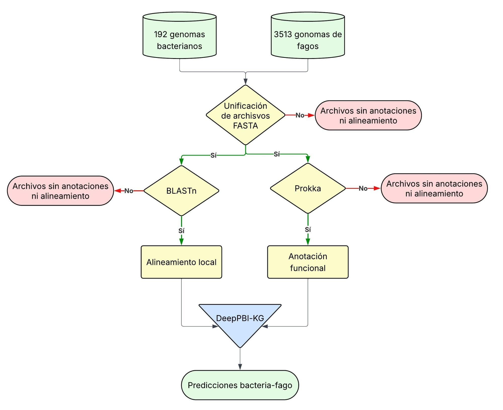
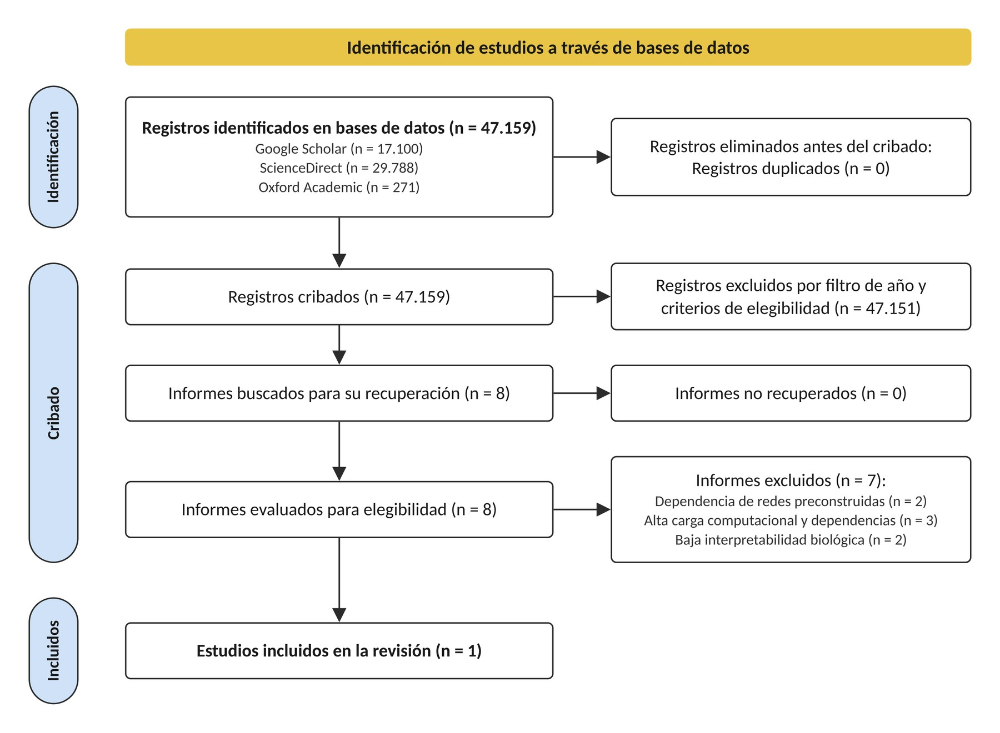

<div align="center">

# 16S-FenrirPipeline

**Predicción de interacciones bacteria-fago en el rizobioma de la gulupa con DeepPBI-KG**


</div>

## Introducción

Esta rama reúne la implementación de **DeepPBI-KG** ([Wei et al., 2024](https://github.com/Tongqing-Wei/DeepPBI-KG)) desarrollada para el trabajo de grado *Análisis del microbioma de Passiflora edulis f. edulis mediante secuenciación dirigida al gen 16S usando MinION, y predicción de las posibles interacciones bacteria-fago* (Johann Sebastian Gallego Sierra, Universidad El Bosque). DeepPBI-KG es un modelo de aprendizaje profundo que estima la probabilidad de que un fago interactúe con una bacteria a partir de sus genomas. Aquí se adaptó para que reciba los perfiles taxonómicos que entrega el pipeline 16S de la rama `pipeline` y evalúe todas las combinaciones posibles entre las bacterias más abundantes y los 3513 fagos de referencia del modelo.

El objetivo es anticipar qué fagos podrían interactuar con las bacterias que componen el rizobioma de la gulupa, en particular con las más abundantes. Junto con la caracterización del rizobioma, ese conocimiento sirve de cimiento para formular, en el futuro, bioproductos dirigidos a este cultivo.

El modelo, sus pesos y el panel de fagos de referencia pertenecen a sus autores. Los scripts de esta rama son adaptaciones del código original o scripts propios.

## Ramas del repositorio

| Rama | Contenido |
|---|---|
| [`pipeline`](https://github.com/xXFenrir/16S-FenrirPipeline/tree/main) | Pipeline 16S ONT: basecalling, estadísticas, limpieza, taxonomía y diversidad (Objetivos 1 y 3) |
| [`algoritmo`](https://github.com/xXFenrir/16S-FenrirPipeline/tree/algoritmo) (esta rama) | Predicción de interacciones bacteria-fago con DeepPBI-KG (Objetivos 2 y 3) |
| [`anexos`](https://github.com/xXFenrir/16S-FenrirPipeline/tree/anexos) | Anexos del documento: tablas de resultados, figuras, matrices de predicción y grafos |

La entrada de esta rama es la tabla de abundancias relativas que produce el paso de taxonomía de la rama `pipeline`. Los genomas descargados, las matrices de predicción, las tablas filtradas y los grafos están en la rama `anexos` (Anexos 11 a 13 y 19 a 21).

# Pasos del algoritmo

El algoritmo se aplicó a dos conjuntos de datos: las abundancias del BioProject PRJNA1020132, que sirvieron para validar la implementación (Objetivo 2, 192 genomas bacterianos y 674 496 pares evaluados), y las abundancias de las muestras de rizobioma de gulupa (Objetivo 3).

<p align="center">
  
</p>

Los pasos se describen tal como se aplicaron a las muestras de gulupa con las abundancias del modelo de basecalling **HAC** (79 genomas bacterianos). Todo se ejecutó en Linux con entornos conda, en CPU. Los scripts están organizados por etapa en tres carpetas.

| Paso | Script principal | Carpeta |
|---|---|---|
| [1. Selección y descarga de genomas](#1-selección-y-descarga-de-genomas) | `descarga_genomas.py` | `01_preparacion_entradas/` |
| [2. Anotación y alineamiento](#2-anotación-y-alineamiento) | `prokka_blast_mod.sh` | `01_preparacion_entradas/` |
| [3. Predicción con DeepPBI-KG](#3-predicción-con-deeppbi-kg) | `DeepPBI-KG_propio.py` | `02_prediccion_DeepPBI-KG/` |
| [4. Filtrado de interacciones](#4-filtrado-de-interacciones) | `filtro_redes.py` | `03_filtrado_y_redes/` |
| [5. Redes de interacción](#5-redes-de-interacción) | `filtrar_top_taxones_comprobacion.py` | `03_filtrado_y_redes/` |

Cada corrida tiene su propia carpeta de trabajo. Los comandos de abajo se ejecutan dentro de la de gulupa HAC y usan dos variables con la ubicación de esta rama y del repositorio original de DeepPBI-KG:

```bash
cd "/home/fenrir/Documentos/Tesis/Algoritmo/con mis datos/HAC/results"
ALG=/ruta/a/16S-FenrirPipeline    # esta rama (algoritmo)
DPBI=/ruta/a/DeepPBI-KG           # repositorio original de DeepPBI-KG
```

<details>
<summary><b>Revisión bibliográfica para escoger el algoritmo</b></summary>
<br>

DeepPBI-KG se escogió tras una búsqueda en Google Scholar, ScienceDirect y Oxford Academic (2020 en adelante). De ella salieron 8 herramientas con software publicado y repositorio de acceso libre (PTBGRP, CoMPHI, PB-LKS, PHISDetector, DeepPBI-KG, GSPHI, iPHoP y PBIP), que se compararon por reproducibilidad, costo computacional e interpretabilidad biológica. Las demás se descartaron por depender de redes preconstruidas, por su carga computacional y de dependencias, o por funcionar como cajas negras.

<p align="center">
  
  <br><sub>Diagrama de flujo PRISMA para la búsqueda y selección del algoritmo predictivo (Figura 22 de la tesis)</sub>
</p>
</details>

---

## 1. Selección y descarga de genomas

### Para qué sirve

DeepPBI-KG trabaja con genomas completos, no con lecturas del gen 16S. Este paso traduce el perfil taxonómico en un conjunto de genomas: toma los taxones con abundancia relativa promedio de al menos 0,1 % y descarga de NCBI un genoma de referencia para cada uno. El resultado es un archivo FASTA (`.fna`) por taxón, que representa a esa bacteria en la predicción.

### Herramientas

**NCBI Datasets** (`datasets`) es la herramienta de línea de comandos de NCBI para descargar ensamblajes genómicos. Acepta un TaxID o un nombre científico, y permite filtrar por nivel de ensamblaje (completo, cromosoma, scaffold) y pedir solo el genoma de referencia de un taxón.

<details>
<summary>Instalación de NCBI Datasets</summary>

```bash
conda install -c conda-forge ncbi-datasets-cli
datasets --version
```
</details>

### Cómo se construyó el script

`descarga_genomas.py` lee la tabla de abundancias relativas de EMU, cuyos taxones vienen identificados como `rango|tax_id|nombre`. Calcula la abundancia promedio de cada taxón entre todas las muestras, conserva los que superan el mínimo y los ordena de mayor a menor. Para cada taxón busca un genoma en cascada:

1. Por el TaxID exacto de la especie.
2. Por el nombre científico, si el TaxID no tiene ensamblajes.
3. Por el género, pidiendo solo el genoma de referencia para obtener un único representante.

En cada intento prefiere ensamblajes completos y, si no hay, acepta los de nivel cromosoma o scaffold. Mientras descarga vigila el tamaño del archivo y aborta si supera 300 MB, porque algunas consultas, como especies con miles de ensamblajes depositados, pueden intentar bajar decenas de GB. Guarda cada genoma como `taxid_<id>_<especie>.fna`, `name_<especie>.fna` o `GENERO_<género>_<taxid>.fna`; los scripts de redes usan ese nombre para recuperar el taxón. Espera un segundo entre taxones para respetar el límite de peticiones de NCBI.

`bact_data.py` es la versión anterior del mismo procedimiento, con rutas fijas y los N taxones más abundantes en lugar de un umbral, y se usó en el Objetivo 2.

### Ejecución

```bash
python3 $ALG/01_preparacion_entradas/descarga_genomas.py \
  -t /home/fenrir/Documentos/Tesis/datos_gulupa/data_gulupa_qs8/EMU_propio/EMUhac_results/feature_table_relabund_hac_results.tsv \
  -ob bacterias_fna \
  -min 0.001
```

- `-t` tabla de abundancias relativas de EMU (taxones en filas, muestras en columnas).
- `-ob` carpeta donde se guardan los genomas bacterianos.
- `-min` abundancia relativa promedio mínima; `0.001` equivale a 0,1 %.
- Opcionales: `-ps` / `-op` enlazan los FASTA del panel de fagos (por ejemplo, `$DPBI/phage_raw_data`) en la carpeta de la corrida, para tener fagos y bacterias en el mismo lugar.

---

## 2. Anotación y alineamiento

### Para qué sirve

DeepPBI-KG no lee secuencias crudas: calcula sus características a partir de los genes de cada genoma. Este paso anota los genes codificantes (CDS) de cada fago y de cada bacteria, y alinea cada genoma contra una base de referencia para encontrar el más parecido. El modelo no usa ese alineamiento para predecir, pero su reporte lo incluye para relacionar cada genoma con interacciones ya descritas en los datos de entrenamiento. El resultado es una carpeta de anotación por genoma, con su archivo GenBank, y un archivo de alineamiento por genoma.

### Herramientas

- **Prokka** anota genomas procariotas y virales: predice los genes codificantes con Prodigal y asigna a cada uno un producto por homología contra bases de proteínas. Entrega, entre otros, un archivo GenBank con la secuencia y la anotación de cada CDS, que es lo que lee DeepPBI-KG.
- **BLASTn** alinea una secuencia de nucleótidos contra una base de datos y reporta los aciertos ordenados por similitud. Aquí se conserva solo el mejor acierto de cada genoma.

<details>
<summary>Instalación (entorno de DeepPBI-KG) y bases BLAST</summary>

```bash
conda create -n DeepPBI-KG python=3.9
conda activate DeepPBI-KG
conda install -c bioconda prokka blast
prokka --setupdb

# Base de fagos: viene con DeepPBI-KG en all_phage_db/
# Base de bacterias: se arma con los genomas descargados en el paso 1
mkdir -p all_host_db
cat bacterias_fna/*.fna > all_host_seq.fasta
makeblastdb -dbtype nucl -in all_host_seq.fasta -parse_seqids -out all_host_db/all_host_seq.db
```

Las bases `.nsq` de DeepPBI-KG están en Git LFS. Si al clonar quedan como archivos de pocos bytes, se regeneran con `integrate_seq.py` y `makeblastdb`, como indica el README del repositorio original.
</details>

### Cómo se construyó el script

`prokka_blast_mod.sh` es la versión modificada de `prokka_blast.sh` de DeepPBI-KG. Recorre los genomas de una carpeta y, para cada uno, ejecuta Prokka (salida en `prokka_<genoma>/`) y BLASTn con formato tabular y un solo acierto (salida en `<genoma>.out`). Frente al original:

- Recorre la carpeta con rutas entre comillas, porque el script original fallaba con espacios en la ruta, como en `con mis datos`.
- Acepta genomas `.fasta` y `.fna`; el original solo aceptaba `.fasta`.
- Ejecuta Prokka con todos los núcleos (`--cpus 0`) y BLASTn con 16 hilos.

`anotar_todo.py` ejecuta solo Prokka por lotes sobre las carpetas de fagos y de bacterias, indicando el reino de cada grupo (`Viruses` o `Bacteria`) y saltando los genomas que ya tienen anotación, lo que permite retomar la anotación de los 3513 fagos si se interrumpe.

### Ejecución

```bash
mkdir -p fagos_annot fagos_align bacterias_annot bacterias_align

bash $ALG/01_preparacion_entradas/prokka_blast_mod.sh \
  -i fagos_fna -o fagos_annot \
  -p "$(which prokka)" -b "$(which blastn)" \
  -d $DPBI/all_phage_db/all_phage_seq.db \
  -O fagos_align

bash $ALG/01_preparacion_entradas/prokka_blast_mod.sh \
  -i bacterias_fna -o bacterias_annot \
  -p "$(which prokka)" -b "$(which blastn)" \
  -d all_host_db/all_host_seq.db \
  -O bacterias_align
```

- `-i` carpeta con los genomas (`.fasta` o `.fna`).
- `-o` carpeta donde Prokka crea una subcarpeta `prokka_<genoma>/` por genoma.
- `-p` / `-b` rutas a los ejecutables de Prokka y BLASTn.
- `-d` base BLAST contra la que se alinea cada genoma.
- `-O` carpeta de los resultados de BLASTn; debe existir antes de ejecutar.

---

## 3. Predicción con DeepPBI-KG

### Para qué sirve

Estima, para cada par fago-bacteria, la probabilidad de que interactúen. Como no se sabe de antemano qué fagos podrían atacar a las bacterias del rizobioma, se evalúan todas las combinaciones entre los 3513 fagos de referencia y las bacterias del paso 1. El resultado es una tabla con dos probabilidades por par y un reporte HTML.

### Herramientas

**DeepPBI-KG** describe cada genoma con características calculadas a partir de sus CDS:

- **De ADN:** frecuencia de cada nucleótido, contenido GC, frecuencia de cada codón y su uso relativo entre codones sinónimos.
- **De proteína:** propiedades fisicoquímicas (peso molecular, punto isoeléctrico, inestabilidad, fracciones de estructura secundaria), composición de aminoácidos y los descriptores CTD y Z-scale.

Cada CDS queda descrito por 223 características (133 de ADN y 90 de proteína), que se resumen sobre todos los genes del genoma con seis estadísticos (media, máximo, mínimo, desviación estándar, mediana y varianza). Así, cada genoma queda representado por 6 × 223 = 1338 valores, sin importar su longitud. Para cada par se unen los vectores del fago y de la bacteria (2676 valores), se estandarizan con el escalador del modelo y entran a una red neuronal profunda con cinco capas ocultas y una neurona de salida sigmoide, cuyo resultado es una probabilidad entre 0 y 1.

El modelo tiene dos versiones con la misma arquitectura y pesos distintos:

- **Genes clave** (`key_gene_output`): usa solo los CDS de una lista de genes que los autores seleccionaron con Random Forest como determinantes de la interacción; estima el potencial de infección.
- **Genoma completo** (`wgs_output`): usa todos los CDS; estima la compatibilidad a nivel de genoma.

<details>
<summary>Instalación de los módulos de Python</summary>

```bash
conda activate DeepPBI-KG
pip install torch==1.9.0+cpu torchvision==0.10.0+cpu torchaudio==0.9.0 -f https://download.pytorch.org/whl/torch_stable.html
pip install scikit-learn biopython numpy pandas
```

De DeepPBI-KG se usa la carpeta `model/`, con los pesos (`.pth`), los escaladores (`.pkl`), las listas de genes clave y la tabla de interacciones de referencia.
</details>

### Cómo se construyó el script

`DeepPBI-KG_propio.py` conserva el cálculo de características, la arquitectura y los pesos del script original, y cambia la forma de ejecutarlo para que pueda procesar miles de genomas en CPU:

1. Calcula las características de los genomas en paralelo, un proceso por archivo de CDS, usando todos los núcleos menos uno, y arma la tabla de una sola vez en lugar de llenarla fila por fila.
2. Si encuentra `template/feature_file/`, reutiliza las características ya calculadas y pasa directo a la predicción, para repetir la corrida sin recalcular.
3. Predice por lotes de unas 10 000 combinaciones sobre una matriz reservada de antemano, en lugar de construir todas las combinaciones en memoria antes de predecir.
4. Arma la tabla de resultados con el producto cruzado de fagos y bacterias, en lugar de buscar cada par por separado.
5. Relaciona los aciertos de BLAST con los FASTA por el identificador de cada secuencia y no por el nombre del archivo, porque los genomas bacterianos son ensamblajes de varios contigs.
6. Escribe el reporte HTML por bloques de texto, para que funcione con cientos de miles de filas.

### Ejecución

```bash
mkdir -p template output

python3 $ALG/02_prediccion_DeepPBI-KG/DeepPBI-KG_propio.py \
  --phage_annotation fagos_annot --bacterium_annotation bacterias_annot \
  --phage_align_res fagos_align --bacterium_align_res bacterias_align \
  --phage_raw_data fagos_fna --bacterium_raw_data bacterias_fna \
  --model $DPBI/model \
  --template template \
  --output output
```

- `--phage_annotation` / `--bacterium_annotation` carpetas de Prokka del paso 2.
- `--phage_align_res` / `--bacterium_align_res` resultados de BLASTn del paso 2.
- `--phage_raw_data` / `--bacterium_raw_data` FASTA de los genomas, para enlazar en el reporte la secuencia del mejor acierto.
- `--model` carpeta `model/` de DeepPBI-KG.
- `--template` carpeta de resultados intermedios: secuencias de los CDS y tablas de características.
- `--output` carpeta donde se escriben `result.csv` y `result.html`.

---

## 4. Filtrado de interacciones

### Para qué sirve

La predicción asigna una probabilidad a cada uno de los cientos de miles de pares evaluados, y la mayoría no corresponde a interacciones plausibles. Este paso conserva solo las interacciones con alta probabilidad, usando un umbral de 0,85. El resultado son tres tablas de interacciones listas para importar en Gephi.

### Herramientas

El filtrado se hace con código propio en pandas. Se aplica el umbral a cada salida del modelo por separado y a la **probabilidad compuesta**, el promedio de ambas. La compuesta es la que se usa para las redes, porque exige que el par sea favorable tanto a nivel de genes clave como de genoma completo: una sola salida alta no alcanza si la otra es baja.

### Cómo se construyó el script

`filtro_redes.py` convierte las dos salidas a números, reemplaza los valores vacíos por 0 y escribe tres tablas:

1. `interacciones_key_gene.csv`: pares cuya probabilidad de genes clave supera el umbral.
2. `interacciones_wgs.csv`: pares cuya probabilidad de genoma completo supera el umbral.
3. `interacciones_comp.csv`: pares cuya probabilidad compuesta supera el umbral, conservando también las dos probabilidades individuales.

En las tres, las columnas se renombran a `Source` (fago), `Target` (bacteria) y `Weight` (probabilidad), el formato de tabla de aristas que Gephi importa directamente.

### Ejecución

```bash
mkdir -p output/red_gephi

python3 $ALG/03_filtrado_y_redes/filtro_redes.py \
  --input output/result.csv \
  --output_dir output/red_gephi \
  --threshold 0.85
```

- `--input` tabla de predicciones del paso 3.
- `--output_dir` carpeta donde se escriben las tres tablas.
- `--threshold` probabilidad mínima; si se omite, el script usa 0,90.

---

## 5. Redes de interacción

### Para qué sirve

Representa las interacciones filtradas como una red en la que los nodos son fagos y bacterias, y cada arista es una interacción predicha. La red muestra qué bacterias concentran más interacciones y qué fagos podrían infectar a varias bacterias. Se construyó la red completa y una reducida a los cuatro taxones más abundantes del rizobioma (*Lactococcus lactis*, *Weissella soli*, *Weissella oryzae* y *Lactobacillus coryniformis*), cuyas interacciones con mayor puntaje se contrastan con la literatura (tablas *Top5_interacciones_por_taxon* de los Anexos 12 y 20) y se clasifican como evidencia directa, evidencia por cercanía taxonómica o sin evidencia. El resultado son los grafos de Gephi de ambas redes.

### Herramientas

- **Gephi** visualiza y analiza grafos. Las redes se dibujaron con una distribución dirigida por fuerzas, en la que los nodos conectados se atraen y los demás se repelen, de modo que los grupos de fagos que comparten bacterias quedan juntos. El tamaño de cada nodo es proporcional a su grado, es decir, a su número de interacciones.

### Cómo se construyó el script

1. `filtrar_top_taxones_comprobacion.py` toma una tabla de aristas con los identificadores originales, como la que produce `filtro_redes.py`, les asigna nombres legibles y la filtra a una lista de taxones. Para los fagos toma la descripción del encabezado de su FASTA (por ejemplo, `GQ303259` → *Mycobacterium phage Colbert*); para las bacterias, la deduce del nombre de archivo del paso 1. Si dos identificadores terminan con el mismo nombre, conserva la arista con el peso máximo y lo avisa. La comparación de nombres no distingue mayúsculas y tolera la variante *Weisella*.
2. `filtrar_top_taxones.py` aplica el mismo filtro a una tabla que ya tiene nombres legibles.

La red completa, que es la tabla `interacciones_comp.csv` del paso 4, y la red reducida a los cuatro taxones se importan en Gephi como tablas de aristas.

### Ejecución

```bash
python3 $ALG/03_filtrado_y_redes/filtrar_top_taxones_comprobacion.py \
  --input output/red_gephi/interacciones_comp.csv \
  --phage_fasta fagos_fna \
  --output output/red_gephi/interacciones_comp_top4.csv \
  --taxones "Lactococcus lactis,Weissella soli,Weissella oryzae,Lactobacillus coryniformis"
```

- `--input` tabla de aristas de `filtro_redes.py`, con los identificadores originales.
- `--phage_fasta` carpeta con los FASTA de los fagos, o un único FASTA con todos ellos, de donde se toman sus nombres; si se omite, los fagos conservan su identificador.
- `--taxones` lista de taxones separados por comas.
- `--output` tabla filtrada con nombres legibles, que se importa en Gephi como tabla de aristas.
- `filtrar_top_taxones.py` recibe `--input`, `--output` y `--taxones`, pero sobre una tabla que ya tiene nombres legibles.

---

<div align="center">

Johann Sebastian Gallego Sierra · Universidad El Bosque

</div>
