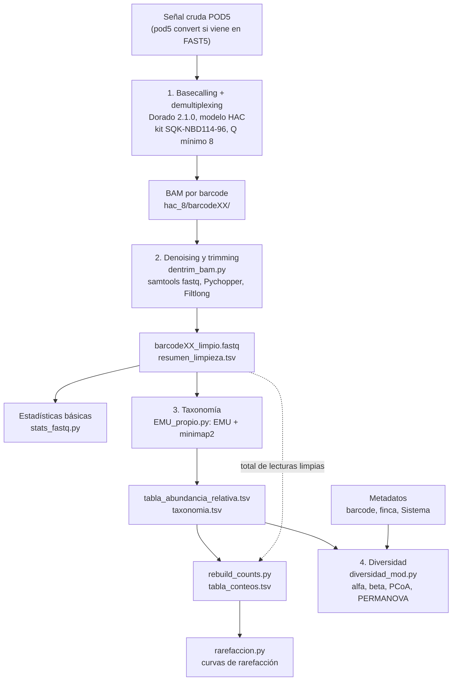

# Anexo C. Protocolo bioinformático detallado: comandos y parámetros

Este anexo documenta, etapa por etapa, los comandos exactos con los que se procesaron las lecturas 16S de la corrida de gulupa, el significado de cada parámetro y el valor usado. Complementa la sección de metodología del documento, donde solo se resumen las herramientas.

Las rutas son las del equipo donde se ejecutó el análisis (`/home/fenrir/Documentos/Tesis/...`). Para reproducirlo en otro equipo basta con reemplazar ese prefijo.

## C.1 Flujo general



| Etapa | Herramienta / script | Entrada | Salida | Entorno |
|---|---|---|---|---|
| 0 | `pod5 convert fast5` (solo si hace falta) | FAST5 | POD5 | ⏳ |
| 1 | Dorado 2.1.0 (`basecaller hac`) | POD5 | BAM por barcode + `sequencing_summary.txt` | Binario de ONT |
| 2 | `dentrim_bam.py` | BAM por barcode | `<barcode>_limpio.fastq`, `resumen_limpieza.tsv` | `dentrim_env` |
| 2b | `stats_fastq.py` | FASTQ crudos o limpios | Tabla TXT + XLSX | ⏳ |
| 3 | `EMU_propio.py` | `*_limpio.fastq` | Abundancias relativas + taxonomía | ⏳ |
| 3b | `rebuild_counts.py` | Abundancias relativas + `resumen_limpieza.tsv` | `tabla_conteos.tsv` | ⏳ |
| 3c | `rarefaccion.py` | `tabla_conteos.tsv` | Curvas de rarefacción (PNG) | ⏳ |
| 4 | `diversidad_mod.py` | Abundancias relativas + metadatos | Tablas y figuras de diversidad | ⏳ |

⏳ = se completa con `anexos/datos/entorno/versiones_software.tsv` (ver [Anexo B](B_entorno_y_software.md)).

## C.2 Basecalling y demultiplexing (Dorado)

Si la corrida quedó en formato FAST5, primero se convierte a POD5:

```bash
pod5 convert fast5 /ruta/fast5/*.fast5 --output pod5_out/
```

Comando usado:

```bash
~/dorado-2.1.0-linux-x64/bin/dorado basecaller hac \
  /home/fenrir/Documentos/Tesis/datos_gulupa/20260715_1807_MN30942_FAZ24575_f8347d8d/pod5 \
  --kit-name SQK-NBD114-96 \
  --min-qscore 8 \
  --emit-summary \
  --output-dir /home/fenrir/Documentos/Tesis/datos_gulupa/data_gulupa_qs8/hac_8 \
  > /home/fenrir/Documentos/Tesis/datos_gulupa/data_gulupa_qs8/hac8_calls.bam
```

| Parámetro | Valor | Qué hace |
|---|---|---|
| modelo | `hac` | Modelo de alta precisión (High Accuracy). El modelo `sup` se evaluó aparte (ver [Anexo I](I_evolucion_y_decisiones.md#i4-modelos-de-basecalling-hac-y-sup)). |
| `--kit-name` | `SQK-NBD114-96` | Kit de barcodes nativos. Con él Dorado asigna el barcode de cada lectura durante el basecalling, sin un paso de demultiplexing aparte (por ejemplo con Porechop). |
| `--min-qscore` | `8` | Descarta lecturas con QScore medio menor que 8 (≈84 % de exactitud por base). |
| `--emit-summary` | — | Escribe `sequencing_summary.txt` con métricas por lectura (longitud, QScore, barcode). |
| `--output-dir` | `.../hac_8` | Carpeta de salida: un BAM por barcode (`barcode01/`, `barcode02/`, ...). |

## C.3 Estadísticas básicas de los FASTQ (`stats_fastq.py`)

```bash
python3 stats_fastq.py \
  /home/fenrir/Documentos/Tesis/datos_gulupa/data_gulupa_qs8/Limpieza/hac_8_trim_edlib \
  -r \
  --primers /home/fenrir/Documentos/Tesis/datos_gulupa/data_gulupa_qs8/Limpieza/primers_gulupa/primers.fasta \
  --name-pattern "*_limpio.fastq*" \
  -o estadisticas_hac.txt \
  --xlsx-out estadisticas_hac.xlsx
```

| Parámetro | Valor | Qué hace |
|---|---|---|
| entrada (posicional) | carpeta de lecturas limpias | Carpeta o archivo FASTQ/FASTQ.GZ. |
| `-r` | — | Busca también en subcarpetas. |
| `--primers` | `primers.fasta` | Estima el % de lecturas en las que aparece algún primer. |
| `--name-pattern` | `*_limpio.fastq*` | Solo analiza los FASTQ que produce `dentrim_bam.py` (por defecto el script busca `*_clean.fastq*`). |
| `-o` / `--xlsx-out` | `estadisticas_hac.txt` / `.xlsx` | Tabla de salida en TXT y XLSX. |

Métricas por muestra: lecturas, bases, longitud promedio/mínima/máxima, N50, %GC, QScore promedio y QScore mínimo/máximo por lectura, y % de lecturas con primer. Las definiciones están en el [Anexo E](E_control_de_calidad.md#e1-definición-de-las-métricas).

Parámetros internos de la búsqueda de primers en la versión de desarrollo (`fastq_estads.py`): ventana de 120 nt en cada extremo, hasta 2 discrepancias, ambas hebras, primeras 10 000 lecturas por archivo. Confirmar que siguen igual en `stats_fastq.py` con `anexos/datos/entorno/ayuda_scripts/stats_fastq.py.txt`.

## C.4 Denoising y trimming (`dentrim_bam.py`)

```bash
python3 dentrim_bam.py \
  -i /home/fenrir/Documentos/Tesis/datos_gulupa/data_gulupa_qs8/hac_8 \
  -o /home/fenrir/Documentos/Tesis/datos_gulupa/data_gulupa_qs8/Limpieza/hac_8_trim_edlib \
  --primers /home/fenrir/Documentos/Tesis/datos_gulupa/data_gulupa_qs8/Limpieza/primers_gulupa/primers.fasta \
  --pconfig /home/fenrir/Documentos/Tesis/datos_gulupa/data_gulupa_qs8/Limpieza/primers_gulupa/primers_config.txt \
  --max-barcode 96 \
  --post-minlen 1000 --post-maxlen 1700 \
  -Q 8 -q 0.52 --fl-min-mean-q 12 \
  -m edlib -t 20 -v
```

Para cada barcode el script: (1) convierte el BAM a FASTQ con `samtools fastq`; (2) detecta primers, orienta y recorta con Pychopper; (3) filtra por longitud y calidad con Filtlong; (4) calcula lecturas, bases, longitud media y mediana, N50 y QScore promedio antes y después.

| Parámetro | Valor | Herramienta | Qué hace |
|---|---|---|---|
| `-i` | `.../hac_8` | — | Carpeta con las subcarpetas `barcodeXX` de Dorado. |
| `-o` | `.../hac_8_trim_edlib` | — | Carpeta de salida. |
| `--primers` | `primers.fasta` | Pychopper `-b` | Secuencias de los primers `16sF` y `16sR` ([Anexo D](D_corrida_muestras_primers.md#d3-primers)). |
| `--pconfig` | `primers_config.txt` | Pychopper `-c` | Configuraciones válidas de primers por hebra ([formato](../config/README.md#formato-de-primers_configtxt)). |
| `--max-barcode` | `96` | — | Último número de barcode a procesar. |
| `-m` | `edlib` | Pychopper `-m` | Busca los primers por distancia de edición (edlib), en vez de perfiles HMM. |
| `-Q` | `8` | Pychopper `-Q` | QScore medio mínimo (Pychopper promedia las probabilidades de error y las pasa a escala Phred). |
| `-q` | `0.52` | Pychopper `-q` | Umbral de detección de primers. Con `edlib`, la distancia de edición máxima por primer es `int(0.52 × longitud del primer)`: hasta 10 ediciones en un primer de 20 nt. Al fijarlo se omite el autoajuste de Pychopper y el resultado es reproducible. |
| `--post-minlen` / `--post-maxlen` | `1000` / `1700` | Filtlong `--min_length` / `--max_length` | Rango de longitud aceptado en pb. El gen 16S completo mide ≈1 500 pb. Es el mismo rango que usa el estudio de referencia de la fase piloto ([Anexo H](H_fase_piloto_datos_publicos.md)). |
| `--fl-min-mean-q` | `12` | Filtlong `--min_mean_q` | Calidad media mínima en Filtlong. ⚠️ Ver la verificación 1 más abajo. |
| `-t` | `20` | Pychopper `-t` | Hilos de CPU. |
| `-v` | — | — | Imprime cada comando ejecutado. |

En Pychopper, las bases degeneradas de los primers (códigos IUPAC como R, Y o M) cuentan como discrepancias con `edlib`, porque Pychopper no le define equivalencias. Si los primers tienen bases degeneradas, parte del margen de `-q` se consume en ellas.

### Verificaciones pendientes de la etapa de limpieza

Hay dos puntos que conviene confirmar antes de la entrega. El script de recolección muestra en `anexos/INVENTARIO_RECOLECCION.md` la evidencia necesaria para ambos.

**Verificación 1. Escala de `--fl-min-mean-q 12`.** Filtlong no interpreta `--min_mean_q` como QScore Phred, sino como **exactitud media por base en porcentaje (0–100)**: su código calcula `100 × promedio(1 − 10^(−Q/10))` por lectura y lo compara con el umbral (README de Filtlong y `src/read.cpp`). Por eso:

| Si `dentrim_bam.py`... | Umbral real en Filtlong | Efecto |
|---|---|---|
| pasa `12` directamente a `--min_mean_q` | 12 % de exactitud (≈Q0.6) | El filtro de calidad de Filtlong no descarta nada: toda lectura ya pasó Q8 en Dorado y en Pychopper. |
| convierte Q12 a porcentaje | 93,69 % | Filtro equivalente a Q12. |

Conversión: `umbral_Filtlong = 100 × (1 − 10^(−Q/10))`. Para Q8 = 84,15; Q10 = 90,00; Q12 = 93,69.

Si ocurre el primer caso, en el documento se debe describir el filtro de calidad efectivo como Q8 (Dorado y Pychopper), o volver a correr la limpieza con `--min_mean_q 93.69`.

**Verificación 2. Orientación de las lecturas.** En la prueba del 23-07-2026 se intentó pasar a Pychopper la configuración `+:16sF,-16sR|+:16sR,-16sF` ([Anexo J](J_problemas_y_soluciones.md#j3-pychopper-no-acepta-la-configuración-de-primers-escrita-en-la-línea-de-comandos)). En ese texto, las dos configuraciones están marcadas como hebra `+`. Pychopper solo invierte (reverso complementario) los segmentos marcados `-` (`chopper.py`), así que con esa configuración las lecturas en sentido reverso **no se reorientan**. El formato documentado es `+:16sF,-16sR|-:16sR,-16sF`.

Cómo comprobarlo: Pychopper anota cada lectura con `strand=+` o `strand=-` en el encabezado. Con la configuración correcta cerca de la mitad de las lecturas limpias dicen `strand=-`. Si ninguna lo dice, las lecturas reversas quedaron sin reorientar.

```bash
grep -c "strand=-" barcode01_limpio.fastq
grep -c "strand=+" barcode01_limpio.fastq
```

Efecto: EMU alinea con minimap2 contra ambas hebras, así que la **clasificación taxonómica no cambia**. Lo que no se sostendría es la afirmación de que todas las lecturas quedan en la misma dirección.

## C.5 Clasificación taxonómica (`EMU_propio.py`, `rebuild_counts.py`, `rarefaccion.py`)

```bash
# 1) Clasificación taxonómica por muestra + agregación global
python3 EMU_propio.py \
  --db /home/fenrir/Documentos/Tesis/emu_db \
  --input-dir /home/fenrir/Documentos/Tesis/datos_gulupa/data_gulupa_qs8/Limpieza/hac_8_trim_edlib \
  --pattern "*_limpio.fastq" \
  --outdir /home/fenrir/Documentos/Tesis/datos_gulupa/data_gulupa_qs8/EMU_propio/EMUhac_results \
  --threads 20 --rank species --min-reads-input 500 \
  --keep-counts --keep-assignments --force

# 2) Reconstrucción de la tabla de conteos enteros
python3 rebuild_counts.py --model hac --dataset results --rank species

# 3) Curvas de rarefacción
python3 rarefaccion.py --model hac --dataset results --n-points 30 --iterations 10
```

| Script | Parámetro | Valor | Qué hace |
|---|---|---|---|
| `EMU_propio.py` | `--db` | `emu_db` | Base de datos de EMU por defecto (rrnDB + NCBI 16S RefSeq; ver [Anexo B](B_entorno_y_software.md#b4-base-de-datos-de-referencia)). |
| | `--input-dir` / `--pattern` | carpeta limpia / `*_limpio.fastq` | Localiza los FASTQ limpios. |
| | `--threads` | `20` | Hilos para EMU/minimap2. |
| | `--rank` | `species` | Nivel taxonómico de agregación. |
| | `--min-reads-input` | `500` | No procesa muestras con menos de 500 lecturas limpias. |
| | `--keep-counts` / `--keep-assignments` | — | EMU conserva los conteos por taxón y la asignación por lectura. |
| | `--force` | — | Reemplaza una salida anterior. |
| `rebuild_counts.py` | `--model` / `--dataset` | `hac` / `results` | Elige, por convención de carpetas, qué corrida de EMU usar. |
| | `--rank` | `species` | Nivel taxonómico. |
| `rarefaccion.py` | `--model` / `--dataset` | `hac` / `results` | Igual que arriba. |
| | `--n-points` | `30` | Profundidades evaluadas por muestra. |
| | `--iterations` | `10` | Submuestreos aleatorios por profundidad (se promedia la riqueza). |

Cómo se reconstruyen los conteos: EMU entrega abundancias relativas y sus conteos por lectura no siempre suman el total real de lecturas limpias de la muestra. `rebuild_counts.py` multiplica cada abundancia relativa por el total de lecturas limpias de esa muestra (de `resumen_limpieza.tsv`; si falta, de las asignaciones de EMU o del FASTQ) y redondea conservando la suma total.

Cómo se construye la rarefacción: para cada muestra se submuestrean lecturas a 30 profundidades crecientes, con un paso proporcional a la profundidad de esa muestra, y se cuenta el número de taxones observados; se repite 10 veces por profundidad y se promedia. Una curva que llega a meseta indica que la profundidad de secuenciación fue suficiente.

## C.6 Diversidad (`diversidad_mod.py`)

```bash
python3 diversidad_mod.py \
  -i /home/fenrir/Documentos/Tesis/datos_gulupa/data_gulupa_qs8/EMU_propio/EMUhac_results/tabla_abundancia_relativa.tsv \
  -o /home/fenrir/Documentos/Tesis/datos_gulupa/data_gulupa_qs8/EMU_propio/Diversidad/hac_results \
  -p Tesis_hac_results \
  -c Sistema \
  -g Empresarial Campesina Agroecológica
```

| Parámetro | Valor | Qué hace |
|---|---|---|
| `-i` | `tabla_abundancia_relativa.tsv` | Tabla de abundancias relativas de la etapa de taxonomía. |
| `-o` | `.../Diversidad/hac_results` | Carpeta de salida. |
| `-p` | `Tesis_hac_results` | Prefijo de los archivos generados. |
| `-c` | `Sistema` | Columna de metadatos que define los grupos. |
| `-g` | `Empresarial Campesina Agroecológica` | Grupos que se comparan. Deben coincidir exactamente con los valores de la columna `Sistema`. |

Análisis que ejecuta el script:

| Análisis | Implementación | Salida |
|---|---|---|
| Diversidad alfa: índice de Simpson y riqueza observada | `skbio.diversity.alpha_diversity` | Tabla por muestra + boxplots por sistema |
| Comparación alfa entre pares de sistemas | Mann-Whitney U (`scipy.stats.mannwhitneyu`) | Valores p por par |
| Diversidad beta: Bray-Curtis y Jaccard | `scipy.spatial.distance.pdist` | Matrices de distancia (TSV) + heatmaps |
| Ordenación | PCoA sobre Bray-Curtis (`skbio.stats.ordination.pcoa`), elipses de confianza al 95 % por sistema | Coordenadas (TSV) + figura |
| Contraste multivariado | PERMANOVA, 999 permutaciones (`skbio.stats.distance.permanova`) | pseudo-F y valor p |

Las fórmulas de cada índice y prueba están en el [Anexo G](G_diversidad_complementaria.md#g1-definiciones-y-fórmulas).

## C.7 Ayuda completa de cada script

El script de recolección guarda la salida de `--help` de cada script en `anexos/datos/entorno/ayuda_scripts/`. Ahí quedan todos los parámetros disponibles y sus valores por defecto, incluidos los que no se usaron en los comandos de arriba.
